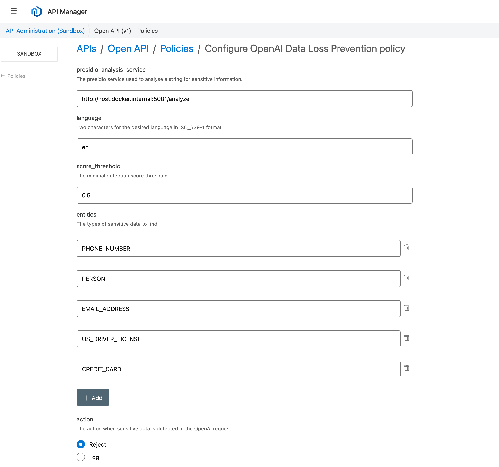

<div align="center">
	
	<h1>Open API Data Loss Prevention Policy</h1>
</div>

<h4 align="center">
	<a href="#overview">Overview</a> |
	<a href="#try-it">Try It</a> |
  <a href="#make-command-reference">Make Reference</a>
</h4>

## Overview

This policy was created with the Flex Gateway Policy Development Kit (PDK). To find the complete PDK documentation, see [PDK Overview](https://docs.mulesoft.com/pdk/latest/policies-pdk-overview) on the MuleSoft documentation site.

The component has the following properties that can be set at design time in App Builder by an administrator

| Property                                   | Description                                                                                                 | Type                                   |
| ------------------------------------------ | ------------------------------------------------------------------------------------------------------------| -------------------------------------- |
| `presidio-analysis-service`                | The Presidio Analyze service location running in Docker                                                     | String    
| `langauge`                                 | The language used by Presidio in ISO-639-1 format                                                           | String    
| `score_threshold`                          | The score threshold in Presidio for it to be flagged as sensitive (0-1)                                     | String    
| `entities`                                 | An array of entities to look for in the OpenAI request                                                      | Array    
| `action`                                   | Log - Log sensitive data but continue or Reject - if sensitive data found return 401 (Unauthorized)         | String    


### Example

When calling the OpenAI API a user will potentially include sensitve data in the prompt.

However, with Flex gateway being used and openai.api.com as the upstream api we can intercept the request and use pii checking utilities to look for sensitive data. In this case Microsoft's Presidio.

This policy assumes you have already added your OpenAI API key to the request header. You can do this in your http client or use the policy [Open API Key Management Policy](https://github.com/deejay-hub/openai-api-key-mgmt)

```
>  curl http://localhost:8081/chat/completions \
  -H "Content-Type: application/json" \
  -d '{
    "model": "gpt-3.5-turbo",
    "messages": [
      {
        "role": "system",
        "content": "You are an assistant, skilled in explaining MuleSoft concepts with creative flair. Keep responses free from bias and without obsenities"
      },
      {
        "role": "user",
        "content": "create a poem in less than 10 words about Max Mule"
      }
    ]
  }'
  
```

With the policy applied the API returns Unauthorized 401
```
Your OpenAI request has sensitive data:
PERSON at 42,50: with certainty 0.85
```

## Try It
These setup steps use Flex Gateway in connected mode running locally on a Mac. Make sure you have docker desktop installed.

### Flex Gateway
Step 1. Follow the instructions [here](https://github.com/deejay-hub/openai-api-key-mgmt) to get Flex Gateway up and running with openai.api.com/v1 as the upstream endpoint.

Step 2. Install Microsoft Presidio using Docker

```
docker pull mcr.microsoft.com/presidio-analyzer
```

```
docker run -d -p 5001:3000 mcr.microsoft.com/presidio-analyzer:latest
```

This will run Presidio's analyzer using the default port 5001.

Step 3. Verify Presidio is running correctly by running the following curl command

```
curl -X POST http://localhost:5001/analyze -H "Content-type: application/json" --data "{ \"text\": \"John Smith drivers license is A123456\", \"language\" : \"en\"}"
```

If the service is running you will get the response that responds with a match for name and drivers licence.
```
[{"analysis_explanation": null, "end": 10, "entity_type": "PERSON", "recognition_metadata": {"recognizer_identifier": "SpacyRecognizer_140733976679664", "recognizer_name": "SpacyRecognizer"}, "score": 0.85, "start": 0}, {"analysis_explanation": null, "end": 37, "entity_type": "US_DRIVER_LICENSE", "recognition_metadata": {"recognizer_identifier": "UsLicenseRecognizer_140733983661648", "recognizer_name": "UsLicenseRecognizer"}, "score": 0.6499999999999999, "start": 30}]%
```

Step 3. Download this policy and use `make build` then `make release`.

Step 4. Apply the policy in API Manager to the API created in Step 3. Leave all default options set.

<p align="center">
  
</p>

Step 5. With the policy applied with default settings any prompt data with name, drivers licence, credit card, email addresses or phone numbers will be rejected.

To test it you can use the following:

The following request should be okay since it contains no PII.
```
curl -X POST http://localhost:8081/flex-api/chat/completions   -H "Content-Type: application/json"  -d '{
    "model": "gpt-3.5-turbo",
    "messages": [
      {
        "role": "system",
        "content": "You are an assistant, skilled in explaining MuleSoft concepts with creative flair. Keep responses free from bias and without obsenities."
      },
      {
        "role": "user",
        "content": "Compose a poem in less than 10 words."
      }
    ]
  }'
```
The following request should fail since we added a name

```
curl -X POST http://localhost:8081/flex-api/chat/completions   -H "Content-Type: application/json"  -d '{
    "model": "gpt-3.5-turbo",
    "messages": [
      {
        "role": "system",
        "content": "You are an assistant, skilled in explaining MuleSoft concepts with creative flair. Keep responses free from bias and without obsenities."
      },
      {
        "role": "user",
        "content": "Compose a poem in less than 10 words about Max Mule."
      }
    ]
  }'
```
This should reply with the Unauthorized 401 response
```
Your OpenAI request has sensitive data:
PERSON at 43,51: with certainty 0.85%
```

## Make command reference
This project has a Makefile that includes different goals that assist the developer during the policy development lifecycle.

*For more information about the Makefile, see [Makefile](https://docs.mulesoft.com/pdk/latest/policies-pdk-create-project#makefile).*

### Setup
The `make setup` goal installs the Policy Development Kit internal dependencies for the rest of the Makefile goals.
Since these dependencies are provided by the Anypoint Platform, it requires the user to be authenticated with a set of valid Anypoint credentials.

*For more information about `make setup`, see [Setup the PDK Build environment](https://docs.mulesoft.com/pdk/latest/policies-pdk-create-project#setup-the-pdk-build-environment).*

### Build asset files
The `make build-asset-files` goal generates all the policy asset files required to build, execute, and publish the policy. This command also updates the `config.rs` source code file with the latest configurations defined in the policy definition.

*For more information about creating a policy definition, see [Defining a Policy Schema Definition](https://docs.mulesoft.com/pdk/latest/policies-pdk-create-schema-definition).*

*For more information about `make build-asset-files`, see [Compiling Custom Policies](https://docs.mulesoft.com/pdk/latest/policies-pdk-compile-policies).*

### Build
The `make build` goal compiles the WebAssembly binary of the policy.
Since the source code must be in sync with the policy definition configurations, this goal runs the `build-asset-files` before compiling.

*For more information about `make build`, see [Compiling Custom Policies](https://docs.mulesoft.com/pdk/latest/policies-pdk-compile-policies).*

### Run
The `make run` goal provides a simple way to execute the current build of the policy in a Docker containerized environment. In order to run this goal, the `playground/config` directory must contain a set of files required for executing the policy in a Flex Gateway instance:
- A `registration.yaml` file generated by performing a Flex Gateway registration in Local Mode. If you already have an instance registered in Local mode, you can reuse the registration file you have and copy it in the `playground/config` folder.
Otherwise, to complete the registration we recommend using the Anypoint Platform:
    1. Go to `Runtime Manager`
    2. Navigate to the `Flex Gateway` tab
    3. Click the `Add Gateway` button
    4. Select `Docker` as your OS and copy the registration command replacing `--connected=true` to `--connected=false`.
    5. Paste the command and run it in the `playground/config` directory.

- An `api.yaml` file updated with the desired policy configuration. This file also supports adding other policies to be applied along the one being developed.

The `playground/config` directory can also contain other resource definitions, such as accessory services used by the policy (Eg. a remote authentication service).

*For more information about `make run`, see [Debugging Custom Policies Locally with PDK](https://docs.mulesoft.com/pdk/latest/policies-pdk-debug-local).*

### Test
The `make test` goal runs unit tests and integration tests. Integration tests are placed in the `tests` directory and are configured with the files placed at the
`tests/<module-name>/<test-name>` directory.

*For more information about writing integration tests, see [Writing Integration Tests](https://docs.mulesoft.com/pdk/latest/policies-pdk-integration-tests).*

### Publish
The `make publish` goal publishes the policy asset in Anypoint Exchange, in your configured Organization.

Since the publish goal is intended to publish a policy asset in development, the _assetId_ and name published will explicitly say `dev`, and the versions published will include a timestamp at the end of the version. Eg.
- groupId: your configured organization id
- visible name: _{Your policy name} Dev_
- assetId: _{your-policy-asset-id}-dev_
- version: _{your-policy-version}-20230618115723_

*For more information about publishing policies, see [Uploading Custom Policies to Exchange](https://docs.mulesoft.com/pdk/latest/policies-pdk-publish-policies).*

### Release
The `make release` goal also publishes the policy to Anypoint Exchange, but as a ready for production asset. In this case, the groupId, visible name, assetId and version will be the ones defined in the project.

*For more information about releasing policies, see [Uploading Custom Policies to Exchange](https://docs.mulesoft.com/pdk/latest/policies-pdk-publish-policies).*


### Policy Examples

The PDK provides provides a set of example policy projects to get started creating policies and using the PDK features. To learn more about these examples see [Custom policy Examples](https://docs.mulesoft.com/pdk/latest/policies-pdk-policy-templates).
